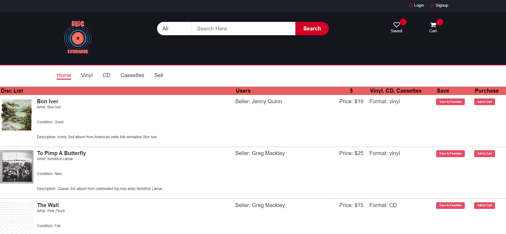

# Project-2 P2P Vinyl & CD Resale

## Description

<!-- Provide a short description explaining the what, why, and how of your project. Use the following questions as a guide:

- What was your motivation?
- Why did you build this project? (Note: the answer is not "Because it was a homework assignment.")
- What problem does it solve?
- What did you learn? -->

### User Story

AS A user,
I WANT a P2P online store dedicated to music,
SO THAT I can buy new vinyls and rare editions no longer for sale;
AS A user who owns albums on CD or vinyl,
I WANT a P2P online store dedicated to music,
SO THAT I can sell albums for a profit to other fans.

<!-- A website where users can list physical music, such as CDs or Vinyl Records, for sale to other users. Users can browse the site by the user (to see all listings from a user), by category (to see all CD listings), etc., select items they're interested in to place into a shopping cart and purchase the items in their shopping cart.

If we can add a search bar to bring up listings that match the search terms (so someone can search Parliament or Funkadelic and get a list of CDs or Vinyl available for purchase from those artists) that would be awesome

We will need to add some kind of selection or add-to-cart button on every listing when generating it through the handlebar -->

## Table of Contents (Optional)

<!-- If your README is long, add a table of contents to make it easy for users to find what they need. -->

- [Installation](#installation)
- [Usage](#usage)
- [Credits](#credits)
- [License](#license)

## Installation

<!-- What are the steps required to install your project? Provide a step-by-step description of how to get the development environment running. -->

### Acceptance Criteria

GIVEN P2P online web aplication,
WHEN I visit the site for the first time,
THEN I am presented with the homepage, which includes navigation links for the homepage, Vinyl, CD, Cassettes and Sell, and the option to log in or sign up.
WHEN I click on the homepage option
THEN I am taken to the homepage
WHEN I click on any other links in the navigation
THEN I am prompted to either sign up or sign in
WHEN I choose to sign up. 
THEN I am prompted to create a username and password
WHEN I click on the sign-up button
THEN my user credentials are saved and I am logged into the site
WHEN I revisit the site at a later time and choose to sign in
THEN I am prompted to enter my username and password
WHEN I am signed in to the site
THEN I see navigation links  and the option to log out. 

## Usage

<!-- Provide instructions and examples for use. Include screenshots as needed.

To add a screenshot, create an `assets/images` folder in your repository and upload your screenshot to it. Then, using the relative filepath, add it to your README using the following syntax:
-->
Screenshot: 
    

    
<!-- ### Short Demo Animation
 -->

### Links

• Deployed Application URL: 
    https://serene-forest-09402.herokuapp.com/
    
• Repository URL: https://github.com/ikaera/Project-2

## Credits

<!-- List your collaborators, if any, with links to their GitHub profiles. -->

- Jack Mabie (https://github.com/jmabie94)
- Terry Sa (https://github.com/apostlex11)
- Nate Johnson (https://github.com/codelearning2021)
- Irakli Eradze (https://github.com/ikaera)

<!-- If you used any third-party assets that require attribution, list the creators with links to their primary web presence in this section.

If you followed tutorials, include links to those here as well. -->

## Technology Used    
    - JavaScript
    - Node.js
    - Express.js & Handlebars.js
    - MySQL2 and Sequelize packages
    - Dotenv
    - Bcrypt
    - Express-Session
    - HTML and CSS 
    - Bootstrap & Font-Awesome    
    - Multer 
    - Express-Visitor-Counter (for future dev)

### FUTURE DEVELOPMENT

- We were not able to properly utilize the Express-Visitor-Counter or Multer npm packages in time, but we have ideas for how to use them.

- We have a shopping cart that items can be added to, but we did not find a way to generate subtotal and continue to a checkout page.

- We still want to implement a functional search bar and make it so most Artist Titles, Names, Sellers and the like are hyperlinked to display similar listings.

## License

MIT License
Copyright (c) [2023] [The Five Loopers]
Permission is hereby granted, free of charge, to any person obtaining a copy
of this software and associated documentation files (the "Software"), to deal
in the Software without restriction, including without limitation the rights
to use, copy, modify, merge, publish, distribute, sublicense, and/or sell
copies of the Software, and to permit persons to whom the Software is
furnished to do so, subject to the following conditions:
The above copyright notice and this permission notice shall be included in all
copies or substantial portions of the Software.
THE SOFTWARE IS PROVIDED "AS IS", WITHOUT WARRANTY OF ANY KIND, EXPRESS OR
IMPLIED, INCLUDING BUT NOT LIMITED TO THE WARRANTIES OF MERCHANTABILITY,
FITNESS FOR A PARTICULAR PURPOSE AND NONINFRINGEMENT. IN NO EVENT SHALL THE
AUTHORS OR COPYRIGHT HOLDERS BE LIABLE FOR ANY CLAIM, DAMAGES OR OTHER
LIABILITY, WHETHER IN AN ACTION OF CONTRACT, TORT OR OTHERWISE, ARISING FROM,
OUT OF OR IN CONNECTION WITH THE SOFTWARE OR THE USE OR OTHER DEALINGS IN THE
SOFTWARE.

---

<!-- 🏆 The previous sections are the bare minimum, and your project will ultimately determine the content of this document. You might also want to consider adding the following sections.

## Badges

Badges aren't necessary, per se, but they demonstrate street cred. Badges let other developers know that you know what you're doing. Check out the badges hosted by [shields.io](https://shields.io/). You may not understand what they all represent now, but you will in time.

## Features

If your project has a lot of features, list them here.

## How to Contribute

If you created an application or package and would like other developers to contribute it, you can include guidelines for how to do so. The [Contributor Covenant](https://www.contributor-covenant.org/) is an industry standard, but you can always write your own if you'd prefer.

## Tests

Go the extra mile and write tests for your application. Then provide examples on how to run them here.
 -->
